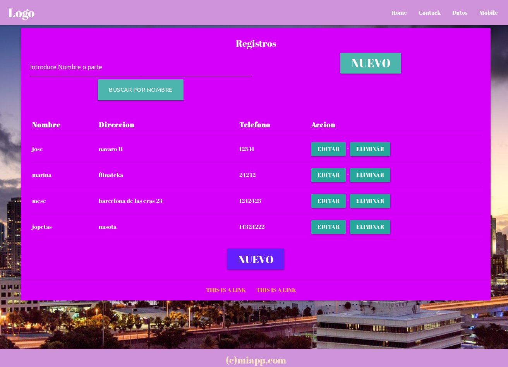

# nodejs-mysql-crud-materialize
nodejs - mysql-crud con materialize 

NODEJS - MYSQL-CRUD CON MATERIALIZE -IMAGEN DE FONDO Y SISTEMA DE BUSQUEDA POR NOMBRE O PARTE DE EL.

SE HA UTILIZADO: Diseños web: MATERIALIZE : https://materializecss.com 
Las animaciones con: https://github.com/daneden/animate.css 
Los iconos con: https://fontawesome.com 
Las fuentes con: https://fonts.google.com/

Y el degradado con: https://cssgradient.io/
